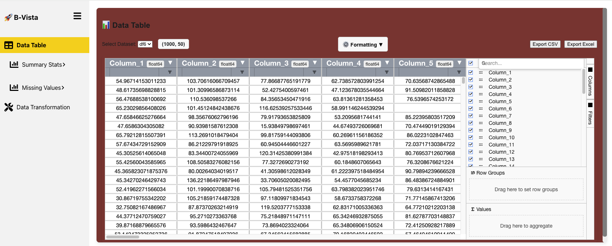

---


# 📊 B-vista

> **Visual, Scalable, and Real-Time Exploratory Data Analysis — Built for modern notebooks and the browser.**

---



## B-vista
**B-vista** is a full-stack Exploratory Data Analysis (EDA) interface for `pandas` DataFrames. It connects a **Flask + WebSocket backend** to a **dynamic React frontend**, offering everything from descriptive stats to missing data diagnostics — in real-time.

---

| **Testing** |    |
|-------------|----------------------------------------------------------------------------------------------------------------------------------|
| **Package** | [](https://pypi.org/project/bvista/) [](https://pepy.tech/project/bvista)  |
| **Meta**    | [](https://github.com/Baci-Ak/b-vista#readme) [](https://opensource.org/licenses/BSD-3-Clause)  |

---


> 🎯 **Designed for**  
> Data Scientists · Analysts · Educators  
> Teams collaborating over datasets  

> 🛠️ **Built with**  
> Python · Flask · WebSockets · React · Plotly · ECharts · Pandas · NumPy


---

## 📚 Contents

- [✨ Features](#-features)
- [🚀 Quickstart](#-quickstart)
- [📦 Installation](#-installation)
- [🛠️ Environment & Compatibility](#️-environment--compatibility)
- [📘 Documentation](#-documentation)
- [📈 Usage Examples](#-usage-examples)
- [💡 In the News](#-in-the-news)
- [🧑‍💻 Developer Setup](#-developer-setup--contributing)
- [📂 Project Structure](#-project-structure)
- [🤝 Contributing](#-contributing)
- [🔖 Versioning](#-versioning)
- [📄 License](#-license)

---

## ✨ Features

- **📈 Descriptive Statistics** — Instant stats (mean, std, quantiles) per column
- **📊 Correlation Matrix** — Heatmaps for Pearson/Spearman correlations
- **📉 Distribution Analysis** — Histograms, KDEs, boxplots by column
- **🧼 Missing Data Detection** — Visual analysis (MCAR, MAR, NMAR)
- **🛠️ Data Cleaning** — Forward/backward fill, interpolation, median, mode, etc.
- **🔁 Data Transformation** — Normalize, standardize, cast, and rename columns
- **📂 CSV Uploads** — Drag and drop from your browser
- **🧪 Jupyter Notebook Integration** — Launch with `bvista.show(df)`
- **📡 Real-time Sync** — WebSocket-powered updates between sessions
- **🌐 Web-based UI** — Modern interface powered by React + Vite

> 🔍 [See full feature breakdown →](docs/features.md)

---

## 🚀 Quickstart

The fastest way to get started (in a notebook):

```python
import pandas as pd
import bvista

df = pd.read_csv("your_dataset.csv")
bvista.show(df)
```


Or from the terminal:

```bash
git clone https://github.com/Baci-Ak/b-vista.git
cd b-vista
python3 -m venv venv
source venv/bin/activate
pip install -r requirements.txt
pip install -e .
python backend/app.py
```

Frontend runs separately:

```bash
cd frontend
npm install
npm start
```

---

## 📦 Installation

### 🧪 From Source (Editable Mode)

```bash
git clone https://github.com/Baci-Ak/b-vista.git
cd b-vista
python3 -m venv venv
source venv/bin/activate
pip install -r requirements.txt
pip install -e .
```

> 💡 You must also start the frontend — see [Frontend Setup](docs/usage/web_interface.md)

---

### 📦 Conda Environment (Optional)

```bash
conda create -n bvista python=3.10
conda activate bvista
pip install -r requirements.txt
pip install -e .
```

---

### 🔹 PyPI (coming soon)

```bash
pip install bvista
```

---

### 🐳 Docker (planned)

Future releases will support Dockerized deployment.

---

## 🛠️ Environment & Compatibility

| Tool      | Version         |
|-----------|-----------------|
| Python    | ≥ 3.7 (tested on 3.10) |
| Node.js   | ^18.x           |
| npm       | ^9.x            |

---

## 🧩 Common Setup Fixes

- `npm start` fails:
  ```bash
  rm -rf node_modules package-lock.json
  npm install
  ```

- Flask not reachable: check `localhost:5050`, free port, or restart backend

- WebSocket not connecting: ensure both backend and frontend are live

---

## 📘 Documentation

- [Getting Started](docs/getting_started.md)
- [Installation](docs/installation.md)
- [Web UI Guide](docs/usage/web_interface.md)
- [Notebook Integration](docs/usage/jupyter_notebook.md)
- [API Endpoints](docs/usage/api_endpoints.md)
- [WebSocket Events](docs/usage/websocket_events.md)
- [EDA Features](docs/features.md)
- [Dev Architecture](docs/development/architecture.md)

> 🔗 See `/docs` folder for all guides

---

## 📈 Usage Examples

### 1. Notebook + UI

```python
import pandas as pd
import bvista

df = pd.read_csv("data.csv")
bvista.show(df)
```

### 2. API Upload

```bash
curl -X POST http://localhost:5050/api/upload \
     -F 'file=@your_file.csv'
```

### 3. Trigger WebSocket

```python
socketio.emit("data_update", {"status": "DataFrame updated"})
```

> Full API listed [here](docs/usage/api_endpoints.md)

---

## 💡 In the News / Inspiration

> "B-vista solves the problem of static pandas outputs — it makes DataFrames **interactive**, **shareable**, and **explorable**."  
> — Community Contributor, Beta Tester

- Inspired by the gaps in tools like **D-Tale**, **Lux**, and **pandas-profiling**
- Designed for **real-world data workflows**, not just pretty plots
- UI built from scratch for **speed**, **clarity**, and **scalability**

---

## 🔗 Related Resources

- [pandas](https://pandas.pydata.org/)
- [D-Tale (Comparative Tool)](https://github.com/man-group/dtale)
- [Lux (EDA Assistant)](https://github.com/lux-org/lux)
- [Flask-SocketIO](https://flask-socketio.readthedocs.io/)
- [Vite](https://vitejs.dev/)
- [Plotly](https://plotly.com/python/)

---

## 🧑‍💻 Developer Setup & Contributing

### Run the Backend

```bash
cd backend
python app.py
```

### Run the Frontend

```bash
cd frontend
npm install
npm start
```

---

## 📂 Project Structure

```text
📦 b-vista
├── backend/            → Flask API, WebSocket, models/
├── frontend/           → React app (Vite)
├── bvista/             → Notebook integration module
├── docs/               → Markdown documentation
├── tests/              → Unit & integration tests
├── datasets/           → Sample CSVs for demos
├── requirements.txt
├── setup.py
└── README.md
```

---

## 🤝 Contributing

We welcome PRs and feedback!  
Start here → [docs/development/contributing.md](docs/development/contributing.md)

- Dev setup instructions
- Code style & linting
- GitHub Actions (planned)
- Test suite guide

---

## 🔖 Versioning

Follows [Semantic Versioning](https://semver.org)

```
Current: v0.1.0 (pre-release)
```

Expect fast iteration and breaking changes until 1.0.0

---

## 📄 License

B-vista is open-source and released under the **[BSD 3](LICENSE)**.

> Contributions, forks, and usage are welcome — just credit the project 💛

---


